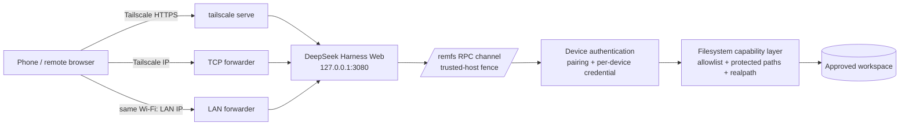

# DeepSeek Harness Phone Remote

**Don't watch your agent. Keep its pulse.**

A secure, zero-app remote workspace for DeepSeek Harness. Reach the real Harness
web UI from your phone over Tailscale (or LAN), manage files and workspaces, and
keep an ambient eye on your agents through Agent Presence — the floating Orb,
Task Board and notifications.

- **🎈 Agent Presence** — floating brand Orb (drag anywhere): Needs You / Failed /
  Possibly Stalled / Running / Done / Idle / Disconnected, with a Task Board and
  browser notifications for what needs you.
- **📁 Files & workspaces** — start/resume an agent in any approved folder; read,
  write, upload, download files.
- **↔ Handoff** — leave the desk and continue the *same* session from your phone
  (`sessions.open` — never a replacement session).
- **🔐 Device pairing** — one-time code, per-device credentials, revocation.

> This project does not replace the Harness UI. It turns Harness itself into a
> remote work environment: the phone opens the *real* DeepSeek Harness web UI over
> Tailscale (or your LAN), and a persistent plugin bridges the gaps a browser
> can't close remotely — authenticated file/workspace access and Agent Presence
> (Orb / Task Board / notifications).

**English** | [中文](README.zh.md) · [Architecture](docs/architecture.md) · [Security](SECURITY.md) · [Contributing](CONTRIBUTING.md)

## Why

- Harness binds `127.0.0.1` — a deliberate, sane default. The Harness process
  itself stays loopback-bound; only the opt-in forwarders (Tailscale IP and,
  when enabled, the LAN IP) expose selected interfaces.
- A phone browser still can't reach loopback, and the GUI's directory picker is
  a loopback-only privileged method — so this plugin adds a **secure path**
  (Tailscale + LAN forwarders) and a **filesystem/workspace bridge** for exactly
  those two gaps.
- Sessions normally die with the page — this plugin is a **persistent loader
  entry**, so the workbench loads on every page automatically, no per-session
  "run" needed.

## Architecture



Three independent layers:

1. **Transport** — who can *reach* the channel: Tailscale membership or your LAN
   (forwarders only bind the Tailscale IP and the LAN IP; never 0.0.0.0).
2. **Application** — who may *use* it: device pairing + per-device credentials.
3. **Capability** — *what* they may touch: the allowlist + protected paths.

`trusted-host` and the tailnet are **transport** trusts. They are not
authentication. Pairing and the filesystem capability layer are.

## Features

- **One-click deploy (auto-installs prerequisites)** — `install.ps1` validates
  the Node version (^22.19 || >=24), installs missing Node.js / Tailscale
  (winget), guides the one-time Tailscale sign-in (re-reads the real MagicDNS
  name — never a fabricated one), writes the launcher, enables HTTPS Serve,
  installs the plugin, registers auto-start on login.
- **Walk-on-LAN (opt-in)** — off by default. Create `%USERPROFILE%\.dsh\lan-on`
  (or set `DSH_REMFS_LAN=1`) to trust the LAN IP and start the LAN forwarder;
  on the same Wi-Fi the phone can then skip Tailscale (`http://192.168.x.x:3080`).
  `/remfs` stays device-authenticated. Enabling it widens the network exposure,
  so it is an explicit choice.
- **Persistent plugin** — loader entry; host channel registers at startup, the
  client module loads on every page. No re-running after refresh.
- **PC always-on-top Orb** — `scripts/orb-widget.ps1` (double-click
  `scripts/start-orb-widget.cmd`, deployed to `~/.dsh/launcher`): a
  zero-dependency WinForms ball that stays above every window, shows the
  highest-priority agent state, is draggable (position persisted), and opens
  the harness on click. Polls the same task DTOs (`/remfs-presence.json`).
  `install.ps1` also registers **auto-start at logon** (a Startup-folder
  entry; single-instance, so the auto-start and the .cmd never stack —
  remove `dsh-orb-widget.cmd` from the Startup folder to disable).
- **Phone push notifications (page closed)** — an opt-in Web Push path: the
  phone registers a same-origin service worker (`/remfs-sw.js`) and, once
  paired, subscribes with the host's VAPID key. The host pushes
  NEEDS_USER/FAILED (and DONE when enabled) transitions even with the tab
  closed. RFC 8291 encryption implemented from scratch (zero deps), verified
  against the official RFC test vector. HTTPS required (Tailscale HTTPS or
  localhost). See [docs/presence-push.md](docs/presence-push.md).
- **Device pairing & management** — one-time pairing code (10 min TTL, single
  use); list / revoke / revoke-all devices; credentials stored only as hashes.
- **Mobile-first workbench** — New Session / Files tabs, breadcrumbs, preview /
  edit / upload / download, workspace badges, floating ball, auto-collapsed
  sidebar, bilingual UI (EN/zh).
- **Host-enforced protected paths** — system dirs, AppData, credential/key files
  (`.credentials.yaml`, `.ssh`, `.aws`, `.gnupg`, `.env`, `id_rsa`, `*.pem` …)
  and private data dirs (WeChat/WPS) are blocked regardless of the allowlist.

## Security model

- **Tailscale ≠ authentication.** It proves *which network* you are on, not
  *who* you are. Device pairing is the application boundary.
- **trusted-host ≠ authentication.** It is the browser-trust fence (Host header +
  cross-site checks). Pairing is the boundary.
- **The Harness process stays loopback-only.** Exposing the web service on a
  network interface happens ONLY through the explicit forwarders (the Tailscale
  IP, and the LAN IP when walk-on-LAN is opted in) — those bind specific
  addresses, never 0.0.0.0.
- **Pairing protects `/remfs` only, not the native Harness `/api`.** The GUI's
  own API surface has no user login; keep the network boundary (tailnet / LAN)
  tight and review which devices can reach it.
- **The filesystem allowlist is the primary file-permission boundary.** Remote
  clients can only *narrow* it; widening (`C:\`, new drives) requires editing
  `.remfs-roots.json` on the PC.
- **Path escape is defended twice**: raw paths with `..`/UNC are rejected, and
  the canonical realpath must stay inside the allowlist (symlink/junction
  escapes fail).
- **Remote writes are encoding-guarded**: uploading or editing a file that is
  not UTF-8 (UTF-16 BOM, GBK/ANSI byte sequences) is rejected instead of
  corrupting it, and the UTF-8 BOM + dominant newline style (CRLF/LF) of an
  edited file are preserved on write-back.
- **The presence read-only fence is an operator switch**: by default the
  Orb/Task Board work unauthenticated inside the browser-trust fence; setting
  `pocketStrict: true` in `~/.dsh/remfs-options.json` requires a valid device
  credential for every `/pocket` call (and for `/remfs-presence.json`).
- **Push subscriptions are paired-device-only**: registering a subscription
  requires a valid device credential; revoked devices are pruned within a
  minute; task titles/summaries are pushed only to paired devices. VAPID keys
  live in `~/.dsh/remfs-push.json` (never in the repo).
- **Tailscale ACLs should be hardened** to phone-only access on 443/3080 — see
  [docs/tailscale-acls.md](docs/tailscale-acls.md).
- See [SECURITY.md](SECURITY.md) for the full threat model (what we do and do
  not protect), and [docs/upgrade.md](docs/upgrade.md) for the pre-upgrade
  backup + verification checklist.

## Positioning

This project is a **secure remote workspace & filesystem bridge** for DeepSeek
Harness: it keeps the native web UI and adds authenticated remote access plus a
capability-bounded file/workspace layer. It is not a UI replacement, skin, or
alternative frontend — the ecosystem has other community projects for those
directions, and they are complementary rather than competing.

## Installation

**Advanced users (npm):**

```bash
dsh plugin --profile web add @zetaluolang/remfs-persistent
# append to %USERPROFILE%\.dsh\profiles\web\cordis.patch.yml:
#   - insert:
#       - id: remfs-persistent
#         name: '@zetaluolang/remfs-persistent'
#         inject: [connection, fs]
# restart dsh web
```

**Windows users (one-click):** double-click **`一键部署.cmd`** — it validates
the Node version (^22.19 || >=24), auto-installs Node.js + Tailscale, guides the
Tailscale sign-in, writes the launcher, registers the self-healing watchdog,
enables HTTPS Serve, installs the plugin and prints the phone URLs (HTTPS,
Tailscale IP, and the LAN IP when walk-on-LAN is enabled).

### First use on the phone (pairing)

1. Open the phone URL (`https://<pc-name>.<tailnet>.ts.net`, or the LAN URL when
   walk-on-LAN is enabled and you are on the same Wi-Fi).
2. The workbench shows the **pairing screen**.
3. On the PC, read the pairing code from
   `%USERPROFILE%\.dsh\remfs-pairing.txt` (or the harness log).
4. Enter the code + a device name on the phone → paired. Credentials are stored
   on the phone; the PC stores only the hash.
5. Revoke devices anytime from the workbench ⋯ → Devices.

### Self-healing watchdog

`install.ps1` registers a Task Scheduler task (**`dsh_harness_watchdog`**, every
5 minutes, current user, hidden window) that runs
`%USERPROFILE%\.dsh\launcher\watchdog.ps1`. Each run:

1. Verifies **our** dsh process actually owns `127.0.0.1:3080` — the owning
   process's command line must contain the deployed dsh bin path (the watchdog
   reuses the launcher's `Get-OwnedHarnessPid` ownership check; a bare open
   port is never trusted, so an unrelated localhost service is never
   mistaken for the harness).
2. If our harness is down and the port is free, restarts it headlessly via
   `restart_harness_once.ps1` (`DSH_HEADLESS=1` — no browser, no dialogs) and
   appends every step to `%USERPROFILE%\.dsh\launcher\watchdog.log`.
3. If a **foreign** process occupies the port, it logs the conflict and stands
   down — it never kills or restarts over a process it does not own.

Re-run `install.ps1` (or `一键部署.cmd`) to update the task definition; the
watchdog itself checks in with one log line every 5 minutes when healthy.

## Threat model

We defend against: unauthenticated RPC, remote allowlist widening, path escape,
credential theft at rest, accidental LAN/public exposure of the GUI.

We do not (yet) defend against: the harness GUI `/api` itself having no user
login (pairing protects `/remfs`, not the GUI — keep the network boundary
tight), a compromised host, or a compromised Tailscale account. Details in
[SECURITY.md](SECURITY.md).

## Troubleshooting

| Symptom | Fix |
|---|---|
| Phone shows the pairing screen forever | Read the code from `%USERPROFILE%\.dsh\remfs-pairing.txt`; codes expire after 10 min — restart the harness to generate a new one |
| Device revoked / re-pairing fails | Pairing codes are single-use; restart the harness for a fresh code |
| Phone gets 403 | Use the printed HTTPS/Tailscale/LAN URL; the GUI must run with those hosts trusted (one-click deploy does it) |
| LAN URL unreachable | Phone must be on the same Wi-Fi; re-run the launcher so the current LAN IP is detected |
| `npm.ps1` blocked by execution policy | Use `npm.cmd`, or `Set-ExecutionPolicy -Scope CurrentUser RemoteSigned` |
| `npm view` 404s right after a publish | CDN edge cache — wait a minute or query with `Cache-Control: no-cache` |
| Plugin never appears after `dsh plugin add` | You must also append the loader row and restart `dsh web` |
| PC sleeps | keep_awake + power plan are handled by the deploy; see `keep_awake.ps1` |
| Harness keeps dying / phone unreachable | Check `%USERPROFILE%\.dsh\launcher\watchdog.log`; re-run `install.ps1` to (re)register the watchdog task |
| Orb widget shows `?` / "Disconnected" | The harness or the forwarder is down — check the watchdog log and `127.0.0.1:3080` |
| Push toggle disabled ("needs HTTPS") | Open the harness via Tailscale HTTPS or `http://localhost:3080`; plain-LAN HTTP can't host a service worker — see [docs/presence-push.md](docs/presence-push.md) |
| No phone push with the page closed | See [docs/presence-push.md](docs/presence-push.md) → Troubleshooting |

## Tested devices

- OPPO Find X8 Ultra (real hardware).
- Emulated matrix: iPhone 16 Pro/SE, Pixel 8, Galaxy S24, Redmi Note, iPad Air,
  iPhone landscape — sidebar collapse, floating ball, panel width, no overflow.
  See `docs/device-tests/`.

## Roadmap

- [x] Tailscale HTTPS + IP access, walk-on-LAN
- [x] Persistent plugin (no per-session run)
- [x] Device pairing + credential auth + revocation
- [x] Capability-bounded allowlist + protected paths + path-escape tests
- [x] Bilingual UI, security tests, CI
- [x] Startup quarantine of corrupt demo sessions + self-healing watchdog
- [x] Session size hints + "suggest archiving" in the phone UI
- [x] Demo-presence behavior tests (idempotent add, fixed cwd, clean-only-demos)
- [x] UTF-8 encoding guard on upload/edit + BOM/newline preservation
- [x] /pocket strict mode (opt-in via `~/.dsh/remfs-options.json`)
- [x] Tailscale ACL hardening guide
- [x] Desktop shortcut automation (install.ps1)
- [x] PC always-on-top Orb widget (scripts/orb-widget.ps1, zero-dependency WinForms)
- [x] Phone Web Push notifications with the page closed (RFC 8291, opt-in per paired device)
- [ ] More device resolutions validation
- [ ] Upstream contributions (see below)

## License

MIT
