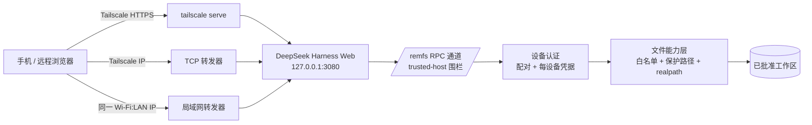

# DeepSeek Harness Remote Workspace

**Secure Remote Workspace & Filesystem Bridge for DeepSeek Harness.**

> 你的 DeepSeek Harness,随处可用——**原生 Web UI**,经安全网络访问,配**设备认证 RPC** 与**能力受限的文件系统**。

本项目不替换 Harness 界面,而是把 Harness 本身变成可远程使用的工作环境:手机通过 Tailscale(或局域网)打开**真正的** DeepSeek Harness Web UI,插件桥接浏览器无法远程完成的两种事——在任意文件夹开始/恢复 Agent 会话,以及读写、上传、下载 PC 文件。

[English](README.md) | **中文** · [架构](docs/architecture.md) · [安全](SECURITY.md) · [贡献](CONTRIBUTING.md)

## 为什么

- Harness 只绑定 `127.0.0.1`——这是合理的安全默认。本项目保留它:GUI 绝不暴露给局域网/公网。
- 手机浏览器够不到 loopback,且 GUI 的目录选择器是仅本机的特权方法——本插件为此补齐**安全通路**(Tailscale + 局域网转发器)与**文件/工作区桥**。
- 普通会话随页面消失——本插件是**持久化 loader 条目**,每次打开页面自动加载,无需重新运行。

## 架构



三层独立信任:

1. **传输层**——谁能*到达*通道:Tailscale 成员或你的局域网(转发器只绑 Tailscale IP 和 LAN IP,从不绑 0.0.0.0)。
2. **应用层**——谁能*使用*:设备配对 + 每设备凭据。
3. **能力层**——能碰*什么*:白名单 + 保护路径。

`trusted-host` 和 tailnet 是**传输层**信任,不是认证。认证是配对,文件边界是能力层。

## 功能

- **一键部署(自动装依赖)**——`install.ps1` 校验 Node 版本(^22.19 || >=24)、自动装 Node.js/Tailscale、引导一次性登录(登录后重新读取真实 MagicDNS 名,绝不伪造)、写启动脚本、开 HTTPS Serve、装插件、注册开机自启。
- **Walk-on-LAN(默认关闭,可选开启)**——在 `%USERPROFILE%\.dsh\lan-on` 创建标记文件(或设环境变量 `DSH_REMFS_LAN=1`)后,才会信任局域网 IP 并启动局域网转发器;同一 Wi-Fi 下手机可绕过 Tailscale 直连 `http://192.168.x.x:3080`,`/remfs` 依旧设备认证。开启会扩大网络暴露面,所以必须显式选择。
- **持久化插件**——loader 条目;host 通道随启动注册,客户端模块随页面加载。
- **设备配对与管理**——一次性配对码(10 分钟有效、仅一次);列出/吊销/吊销全部设备;凭据只存哈希。
- **手机工作台**——新建会话/文件浏览双标签、面包屑、预览/编辑/上传/下载、工作区徽标、悬浮球、侧栏自动收起、中英双语。
- **host 层保护路径**——系统目录、AppData、凭据/密钥文件(`.credentials.yaml`/`.ssh`/`.aws`/`.gnupg`/`.env`/`id_rsa`/`*.pem` 等)与隐私数据目录(微信/WPS)无论白名单如何都拦截。

## 安全模型

- **Tailscale ≠ 认证**:它只证明"在哪个网络",不证明"你是谁"。配对才是应用边界。
- **trusted-host ≠ 认证**:它只是浏览器信任围栏(Host 头 + 跨站检查)。配对才是边界。
- **Harness 进程始终只绑 loopback**:把 Web 服务暴露到网络接口的唯一途径是显式转发器(Tailscale IP,以及开启 walk-on-LAN 时的局域网 IP)——只绑具体地址,绝不绑 0.0.0.0。
- **配对只保护 `/remfs`,不保护原生 Harness `/api`**:GUI 自身 API 没有用户登录;请收紧网络边界(tailnet / 局域网)并定期检查可达设备。
- **文件白名单是主要文件权限边界**:远程客户端只能*收窄*白名单;扩大(`C:\`、新盘符)必须在本机编辑 `.remfs-roots.json`。
- **路径逃逸双重防御**:带 `..`/UNC 的原始路径直接拒绝;规范后的 realpath 必须落在白名单内(符号链接/junction 逃逸失败)。
- 完整威胁模型见 [SECURITY.md](SECURITY.md)。

## 定位

本项目是 DeepSeek Harness 的**安全远程工作区与文件系统桥**:保留原生 Web UI,增加认证远程访问与能力受限的文件/工作区层。它不是 UI 替代品、皮肤或独立前端——生态中其他社区项目走那些方向,彼此互补而非竞争。

## 安装

**高级用户(npm):**

```bash
dsh plugin --profile web add @zetaluolang/remfs-persistent
# 在 %USERPROFILE%\.dsh\profiles\web\cordis.patch.yml 追加:
#   - insert:
#       - id: remfs-persistent
#         name: '@zetaluolang/remfs-persistent'
#         inject: [connection, fs]
# 重启 dsh web
```

**普通 Windows 用户(一键):** 双击 **`一键部署.cmd`** ——校验 Node 版本(^22.19 || >=24)、自动装 Node.js + Tailscale、引导登录、写启动脚本、注册自愈看门狗、开 HTTPS Serve、装插件,并打印手机访问地址(HTTPS / Tailscale IP / 开启 walk-on-LAN 时含 LAN IP)。

### 自愈看门狗

`install.ps1` 会注册一个计划任务(**`dsh_harness_watchdog`**,每 5 分钟、当前用户、隐藏窗口),运行 `%USERPROFILE%\.dsh\launcher\watchdog.ps1`。每次运行:

1. 校验 **我们的** dsh 进程确实占有 `127.0.0.1:3080`——占有进程的命令行必须包含部署的 dsh bin 路径(看门狗复用启动器的 `Get-OwnedHarnessPid` 归属校验;绝不信任裸端口,绝不把无关的 localhost 服务当成 harness)。
2. 若我们的 harness 不在运行且端口空闲,则以无头方式(`DSH_HEADLESS=1`,不开浏览器、不弹窗)调用 `restart_harness_once.ps1` 拉起,并把每一步追加到 `%USERPROFILE%\.dsh\launcher\watchdog.log`。
3. 若端口被**外来**进程占用,则记录冲突并让位——绝不误杀、绝不覆盖重启不属于本项目的进程。

重跑 `install.ps1`(或 `一键部署.cmd`)即可更新任务定义;健康时看门狗每 5 分钟写一行日志。

### 手机首次使用(配对)

1. 打开手机地址(`https://<电脑名>.<tailnet>.ts.net`,或同一 Wi-Fi 的 LAN 地址)。
2. 工作台显示**配对界面**。
3. 在电脑上读取配对码:`%USERPROFILE%\.dsh\remfs-pairing.txt`(或 harness 日志)。
4. 在手机上输入配对码 + 设备名 → 配对完成。凭据存手机,电脑只存哈希。
5. 随时可在工作台 ⋯ → 设备 里吊销设备。

## 威胁模型

**防护**:未认证 RPC、远程扩大白名单、路径逃逸、凭据落盘泄露、GUI 意外暴露到局域网/公网。

**暂不防护**:Harness GUI 的 `/api` 本身没有用户登录(配对保护 `/remfs`,不保护 GUI——请保持网络边界收紧)、宿主机被攻破、Tailscale 账号被攻破。详见 [SECURITY.md](SECURITY.md)。

## 常见问题

| 现象 | 处理 |
|---|---|
| 手机一直停在配对界面 | 读取 `%USERPROFILE%\.dsh\remfs-pairing.txt`;配对码 10 分钟过期——重启 harness 生成新的 |
| 设备被吊销/重新配对失败 | 配对码一次性;重启 harness 获取新码 |
| 手机 403 | 用打印的 HTTPS/Tailscale/LAN 地址;GUI 需把这些主机加入信任(一键部署自动完成) |
| LAN 地址不通 | 手机需在同一 Wi-Fi;重跑启动脚本让 LAN IP 重新检测 |
| `npm.ps1` 被执行策略拦截 | 用 `npm.cmd`,或 `Set-ExecutionPolicy -Scope CurrentUser RemoteSigned` |
| 发布后 `npm view` 404 | CDN 缓存——等一分钟或用 `Cache-Control: no-cache` |
| `dsh plugin add` 后插件没出现 | 必须补 loader 行并重启 `dsh web` |
| 电脑睡眠 | 部署已处理 keep_awake + 电源计划,见 `keep_awake.ps1` |
| harness 反复挂掉/手机连不上 | 查看 `%USERPROFILE%\.dsh\launcher\watchdog.log`;重跑 `install.ps1`(重新)注册看门狗任务 |

## 实测设备

- OPPO Find X8 Ultra(真机)。
- 模拟矩阵:iPhone 16 Pro/SE、Pixel 8、Galaxy S24、Redmi Note、iPad Air、iPhone 横屏——侧栏收起、悬浮球、面板宽度、无溢出均通过。见 `docs/device-tests/`。

## Roadmap

- [x] Tailscale HTTPS/IP + walk-on-LAN
- [x] 持久化插件(免重新运行)
- [x] 设备配对 + 凭据认证 + 吊销
- [x] 能力受限白名单 + 保护路径 + 路径逃逸测试
- [x] 双语界面、安全测试、CI
- [ ] 更多分辨率验证
- [ ] Tailscale ACL 加固指南
- [ ] 上游贡献

## License

MIT
